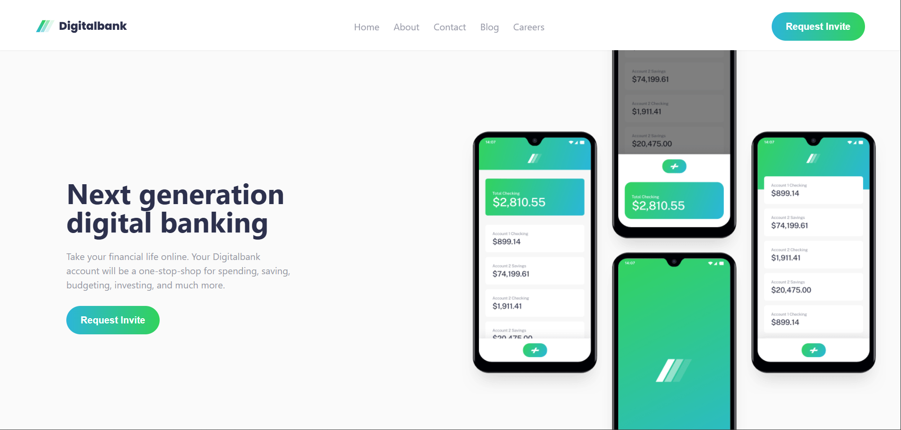

# Digitalbank
A modern digital banking landing page for a next-generation online banking platform.
 

## AIM
The aim of this project is:
- To build a fully responsive landing page for a digital banking product
- To practice and improve Tailwind CSS layout and design skills
- To replicate a professional UI design as closely as possible

 

## FEATURES
The features of the landing page include:
- Sticky navigation bar with smooth hover effects
- Hero section with mockup image and gradient button
- Features section highlighting key banking services
- Testimonials section with floating avatar cards
- Latest articles section with image cards
- Fully responsive footer with social links
- Mobile and desktop responsive design throughout

 

## BUILT WITH
- HTML5
- Tailwind CSS (via CDN)
- Google Fonts — Public Sans

 

## Challenges
Faced challenges positioning the hero mockup image to overflow above the section and recreating the organic blob background shape. To solve it, I used CSS custom border-radius with percentage values to create the blob and negative positioning to make the image bleed beyond its container.

 

## HOW TO ACCESS THE PLATFORM
To Access the Platform, [Click Here](https://digitalbank-wid.netlify.app)

 

## Learning Curve
Learnt a lot of concepts building this project. Such as:
- Tailwind CSS utility-first styling
- Responsive design using Tailwind breakpoints (sm, md, lg)
- CSS Grid vs Flexbox and when to use each
- Absolute and relative positioning for overlapping elements
- Gradient buttons and brightness hover effects
- How parent containers control child layout

 

## Image/Video Demo

